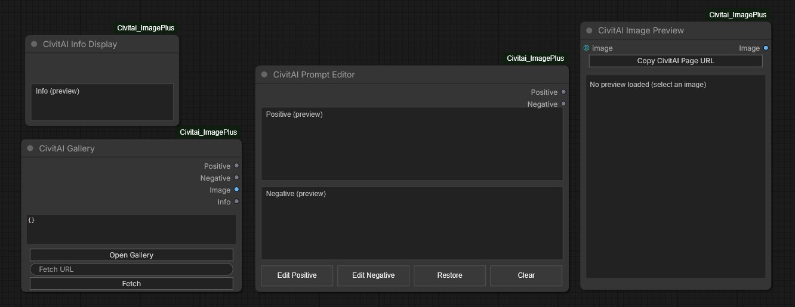
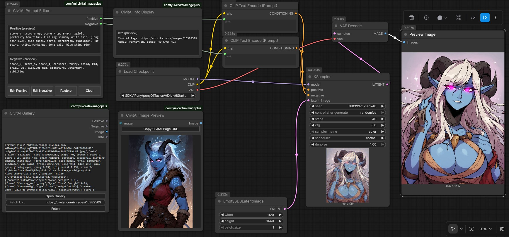
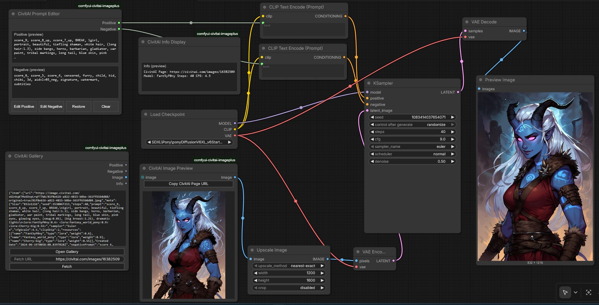
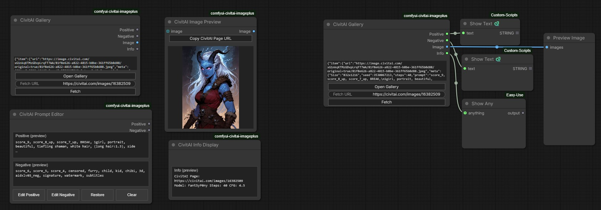

# ComfyUI CivitAI ImagePlus

**Browse CivitAI images in ComfyUI, preview protected images, and edit prompts before you generate and pass to image 2 image.**
Compatible with ComfyUI 0.6+

ComfyUI_CivitAI_ImagePlus adds a CivitAI gallery browser to ComfyUI, plus helper nodes for **image preview with I2I connector**, **prompt editing**, and **quick info**.
Nodes are populated instantly without a need to run the workflow.

---

## ✅ What you can do

- **Open a full-screen CivitAI gallery, display Most Reactions, Most Comments and Newest** from inside ComfyUI
- **Pick an image** and instantly:
  - preview it (including **protected** images if you have an API key)
  - load its prompts into an editor
  - see a handy info panel
- **Fetch by URL** (paste a CivitAI link)
- Use the preview image for **img2img**

---

## 📸 Screenshots & demo workflows

Example workflows:

- `workflows/Gallery_text_to_image.json`
- `workflows/Gallery_image_to_image.json`
- `workflows/Gallery_Z-image_Turbo.json`

**Note:**  
  Gallery text to image and Gallery image to image workflows use ComfyUI core nodes plus this node pack.  
  Gallery Z-image Turbo workflow uses additional custome nodes.  
  Click the Fetch button to grab a random test image, the test image is available without an API key.

---

## 📸 Screenshots
Image2Image and Text2Image workflow examples.  
Alternative 'Show Text' or 'Show Any' nodes can be used but they will not populate automatically, Run will need to initiated first.  
They must also be compatible with Node2 requirements.

**Nodes**  
To search for the nodes type Civit

<p align="center">
  <a href="examples/search.jpg">
    
  </a>
  <a href="examples/nodes.jpg">
    
  </a>
</p>

**Workflow examples**

<p align="center">
  <a href="examples/gallery_T2I.jpg">
    
  </a>
  <a href="examples/gallery_I2I.jpg">
    
  </a>
  <a href="examples/Alt_nodes.jpg">
    
  </a>
</p>

<p align="center"><em>Click any image to open full size.</em></p>

---

## 🧩 Installation

### Option A — ComfyUI Manager
1. Open **ComfyUI → Manager**
2. Install **ComfyUI_CivitAI_ImagePlus**
3. Restart ComfyUI

### Option B — Manual
1. Go to your ComfyUI `custom_nodes` folder:
   - `ComfyUI/custom_nodes/`
2. Clone this repo:
   ```bash
   git clone https://github.com/CovertBannana/ComfyUI_CivitAI_ImagePlus.git
   ```
3. Restart ComfyUI

### Option C — (Zip)
1. If your having trouble with Git, click the Code button, download as Zip and extract the folder to your ComfyUI custom_nodes folder.
2. Restart ComfyUI

## 🔑 CivitAI API Key (required for protected images)

To preview and fetch **protected** content, you need a CivitAI API key.

1. Create the file if it doesn't exist:

```
custom_nodes/ComfyUI_CivitAI_ImagePlus/api_key.txt
```

2. Put your key inside like this:

```txt
CIVITAI_API_KEY=YOUR_CIVITAI_API_KEY_HERE
```

✅ Restart ComfyUI after adding/changing the key.

---

## 🧱 Nodes (what each one does)

### 1) **CivitAI Gallery**
Open the gallery and select images.

- **Open Gallery**: full-screen browsing
- **Fetch URL** + **Fetch**: paste a CivitAI URL and load the image

**Tip:** you can use a **post URL** (example: `https://civitai.com/posts/<id>`) or an **image URL** (example: `https://civitai.com/images/<id>`)

---

### 2) **CivitAI Image Preview**

- **Copy CivitAI Page URL** button: copies the CivitAI page link for the selected image (the page that shows generation info)
- Output: `IMAGE` (great for **img2img**)

---

### 3) **CivitAI Prompt Editor**
Lets you edit prompts before generating.

- Shows **Positive** + **Negative** previews right on the node
- Buttons at the bottom:
  - **Edit Positive** / **Edit Negative** (opens a big editor window)
  - **Restore** (revert to the original prompts from the last selection)
  - **Clear** (wipe prompts)

Output:
- Positive (STRING)
- Negative (STRING)

---

### 4) **CivitAI Info Display**
A small info preview panel that updates instantly when you select an image.

---

## 🔁 Recommended workflow setups

### A) txt2img (browse → edit → generate)
1. Select an image in **CivitAI Gallery**
2. Edit prompts in **CivitAI Prompt Editor**
3. Connect Prompt Editor outputs to your text/CLIP encode nodes
4. Generate

### B) img2img (preview → use as init image)
1. Select an image in **CivitAI Gallery**
2. Confirm it in **CivitAI Image Preview**
3. Use Preview output as your **img2img init image**
4. Edit prompts in Prompt Editor

---

## 🛠 Troubleshooting

### Nothing updates instantly
- Restart ComfyUI
- Hard refresh your browser (Ctrl+F5)

### Protected images won’t preview
- Confirm `api_key.txt` exists and is formatted correctly:
  `CIVITAI_API_KEY=...`
- Restart ComfyUI

### Fetch says “No items returned”
- Prefer using a **post URL** (`/posts/<id>`)
- Some content may still be restricted by your CivitAI browsing/account settings

---

## 🔐 Security notes

- Your API key stays on your machine in `api_key.txt`.
- The browser does **not** need your key.

---

## 📄 License

MIT License (see `LICENSE`).
